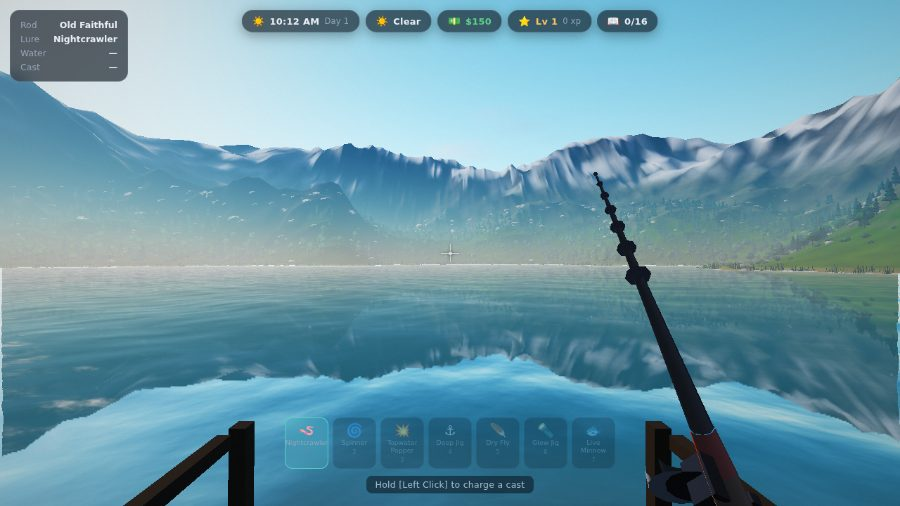
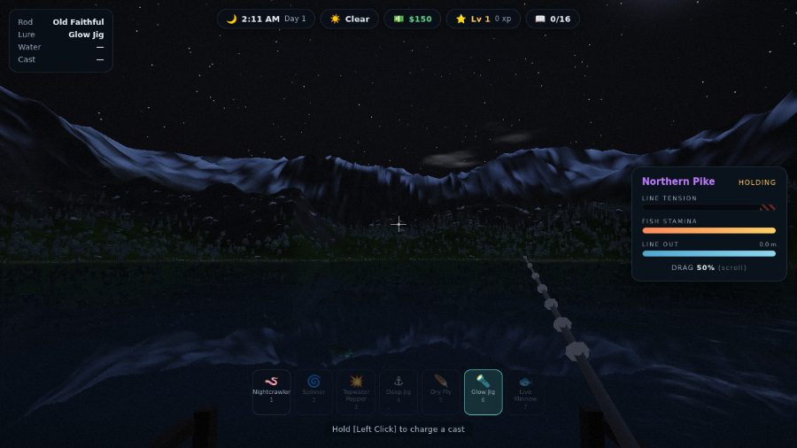
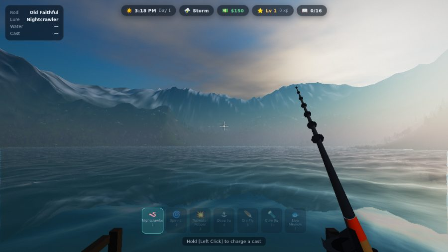
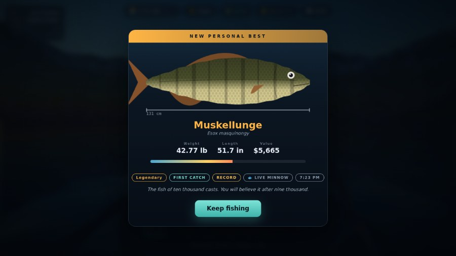
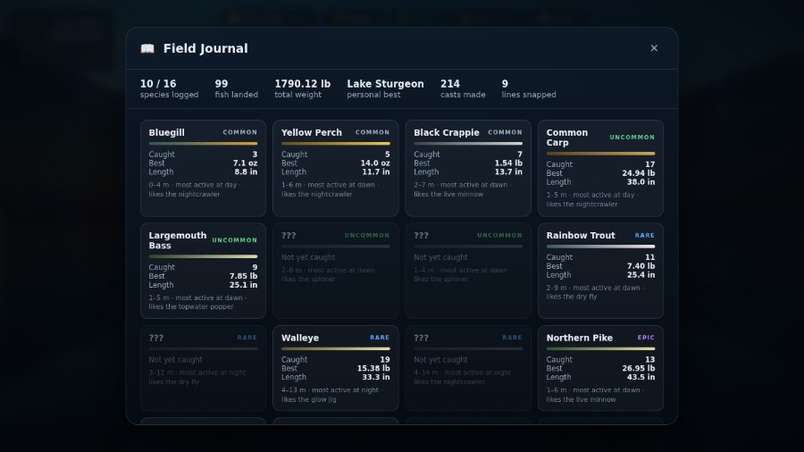

# 🎣 DEEP CAST

**A 3D fishing game that runs in your browser. No install. No downloads. No game engine, no libraries, and not one image or sound file.**

Double-click `index.html`. That's the whole setup.



| | |
|---|---|
|  |  |
|  |  |

---

## ▶️ How to play

1. Open `game/index.html` in a modern browser (Chrome, Edge, Firefox, or Safari).
2. Click **Start fishing**, then click the window to capture your mouse.
3. Fish.

If your browser blocks something when opening the file directly, serve the folder instead:

```
python3 -m http.server 8000
```

…then open <http://localhost:8000/game/>.

> Needs **WebGL2**, which every browser released since about 2018 has. If the
> game says it can't find it, update your browser or turn hardware
> acceleration back on.

---

## 🐟 The loop

| Step | What you do |
|---|---|
| **Cast** | Hold left click to charge the power meter, release to throw. Aim slightly high — the line arcs. |
| **Wait** | The bobber sits. Fish that like your lure, at that depth, at that hour, come to look at it. |
| **Watch** | Little dips are a fish tasting it. When the bobber *plunges* and the screen shouts, click. |
| **Fight** | Hold left click to reel — that loads the line. Let go when the fish runs, or it snaps. |

The **tension bar** is the only thing that can beat you. Pinned in the red for
about half a second and the line parts. The **drag** setting (mouse wheel
during a fight) is a ceiling: let go of the reel and the spool slips at roughly
that value, which is what saves you. Clamp down by reeling and you defeat it.

A bluegill you can crank straight in. A fourteen-kilo pike on the starter rod
will destroy you unless you back the drag off and only wind when it gives.

---

## 🎛️ Controls

| | |
|---|---|
| `W A S D` | walk (you can wade, not swim) |
| `Shift` | run |
| `Mouse` | look |
| `Left click` | charge cast · set the hook · reel |
| `Right click` | cancel cast · reel in |
| `Wheel` | change lure — or adjust drag mid-fight |
| `1`…`7` / `F` | pick lure |
| `R` | reel in |
| `E` / `Q` | board the rowboat · drop anchor |
| `M` / `C` | lake chart · commissions |
| `G` | sounder (once you own one) |
| `Tab` | field journal |
| `B` | tackle shop (also: wait for a better hour) |
| `H` | how to fish |
| `P` | performance stats |
| `Esc` | pause & settings |

---

## 🧭 What's in the lake

**Sixteen species**, from bluegill up through a lake sturgeon that will spool
you, a muskellunge that lives up to its reputation, and two things that
probably shouldn't be in a lake this size at all.

What bites depends on four things, and the journal tells you all of them once
you've caught something:

- **Depth** — every lure fishes at its own depth. A deep jig will never find a
  bluegill in the reeds.
- **Time** — walleye and brown trout are night fish. Bass hunt dawn and dusk.
  One species has never been seen before midnight.
- **Weather** — rain and storms bring the big ones up. Fog hides the rare stuff.
- **Where you cast** — there's a deep hole out to the north-east and a shallow
  weed flat to the south-west. They hold completely different fish.

Money buys lures and rods. Rods buy line strength, reel speed, cast distance,
and a bigger strike window. Progress saves to your browser automatically.

---

## 🔬 How it's built

Everything is generated at load time from a single integer seed. There are no
assets on disk — no textures, no models, no audio files.

```
game/
  index.html          markup for the HUD and every panel
  style.css           all of the interface
  src/
    util.js           vec3 / mat4, seeded RNG, value noise, fBm
    gl.js             a thin WebGL2 layer: programs, VAOs, FBOs
    shaders.js        every line of GLSL in the project
    assets.js         procedural meshes + procedural textures
    species.js        the fish table, the tackle, and the bite rules
    world.js          heightmap, terrain mesh with baked AO, prop scattering
    entities.js       waves, fish AI, tackle physics, the fight simulation
    audio.js          Web Audio: ambience, SFX, and a generative score
    render.js         the four-pass frame
    ui.js             HUD, panels, and the drawn-to-canvas catch portraits
    game.js           input, the player, the clock, the fishing state machine
    main.js           wiring
```

### The renderer

Four passes per frame, all in raw WebGL2:

1. **Planar reflection** — the scene re-rendered through a mirror matrix about
   `y = 0`, above-water geometry only. Because a mirrored point lands on exactly
   the same screen pixel as the water fragment reflecting it, the water shader
   samples this by screen UV with no extra matrix.
2. **Refraction** — below-water geometry into a colour target *and* a depth
   texture. Linearising both that depth and the water's own gives the true
   distance light travels through the water, which drives Beer–Lambert
   absorption, the shoreline wash, and where the lake bed shows through.
3. **Main scene** — terrain, instanced props, instanced fish, the water surface,
   then an analytic sky filling whatever is left.
4. **Post** — bright pass → separable blur → ACES tonemap, vignette, grain.

Other bits worth mentioning:

- **Sky** — a Preetham single-scattering model whose wavelength coefficients are
  computed on the CPU each frame from the sun's elevation and the current
  turbidity. Fog samples the same function per-fragment, which is what gives the
  far mountains their aerial perspective. The sun's arc is deliberately bent so
  it loiters near the horizon: real twilight is minutes, and a fishing game wants
  a golden hour you can actually fish.
- **Water** — five summed Gerstner waves with analytic normals, layered with two
  scrolling procedural normal maps. Whitecap thresholds scale with the sea state,
  so a storm gets chop instead of a snowfield.
- **Terrain** — one 1024² float heightmap is the single source of truth: the mesh
  samples it, the physics samples it, and it goes to the GPU as an R16F texture
  so the water shader can read depth directly. The mesh uses a warped grid —
  1.5 units of spacing through the whole play area, stretching toward the map
  edge — so the topology stays regular and there are no LOD cracks.
- **Fish** — one mesh, instanced, with a travelling sine bend down the body whose
  amplitude ramps toward the tail. Per-instance colour and body proportions turn
  that single mesh into all sixteen species.
- **Audio** — the lake, the wind, the birds, the reel clicks and a generative
  score, all synthesised live. The music changes key and rhythm when something
  large is trying to escape.

### Things that are deliberately not here

No build step. No `package.json`. No transpiler. The scripts are plain
`<script>` tags in dependency order, so `file://` works and you can edit any
file and hit refresh.

---

## 🛠️ Poking at it

Everything hangs off one global. Open the console and try:

```js
DEEPCAST.state.money = 100000      // buy the good rod
DEEPCAST.state.hour  = 1.5         // jump to the small hours
DEEPCAST.rest(19.5)                // or wait for dusk properly
DEEPCAST.setQuality('ultra')       // low | medium | high | ultra
DEEPCAST.shoal.fish.length         // how many fish are swimming right now
```

Erasing your save is in the pause menu, or `localStorage.clear()`.

If it runs slowly, drop the graphics setting in **Esc → Graphics**. The
expensive parts, in order, are the reflection pass, the water grid density, and
bloom.

---

## 🚣 The boat

A rowboat is moored beside the dock. `E` to board, `WASD` to row, `Q` to drop
the anchor, `E` again to step out onto anything solid within reach.

It has real momentum — pulse thrust on each oar stroke, water drag, and a wind
that pushes you off your spot if you don't anchor. Rowing over fish spooks
them for a while, so arrive quietly and drop the hook before you cast.

This matters more than it sounds: the deep hole and the weed flat that the
whole depth-and-species system is built around sit well beyond casting range
of the dock. Until you take the boat out, most of the lake is theoretical.

---

## 📡 The sounder

$2,600 in the shop's **Gear** tab buys a Loon Mk II. It clamps to the transom,
so it only reads while you are aboard the boat, and `G` switches it on and off.

It draws the way a real sounder does: newest ping at the right edge, history
scrolling away to the left. You get the bottom contour, the hard bottom
return, a depth grid, and marks for anything inside the transducer cone —
brightness is return strength, width is size. A fish holding under the hull
paints a long band; one crossing the cone leaves a short one.

It is the difference between knowing the lake is 30 m deep somewhere and
watching the bottom fall away underneath you as you row over the edge of it.
